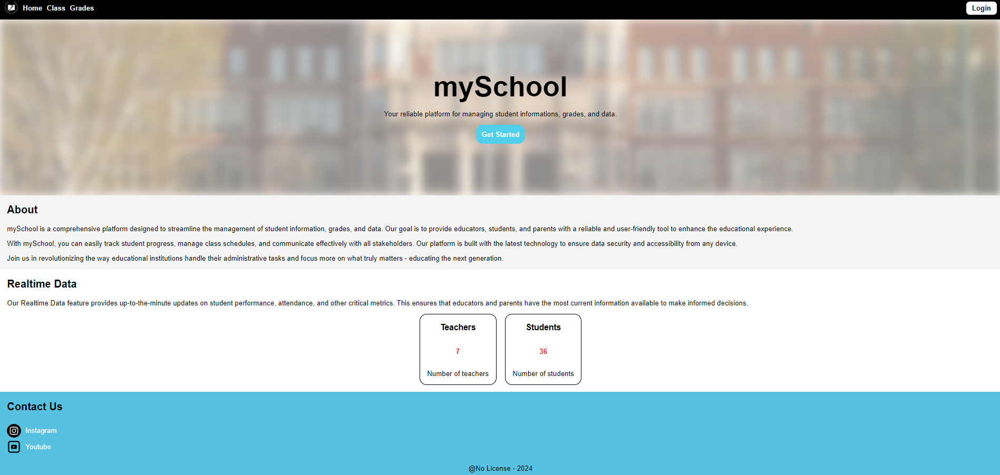
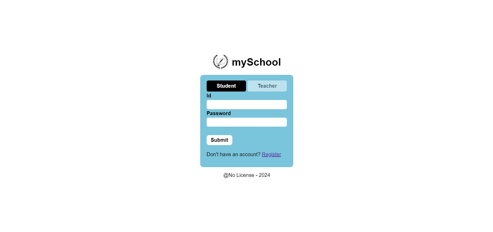
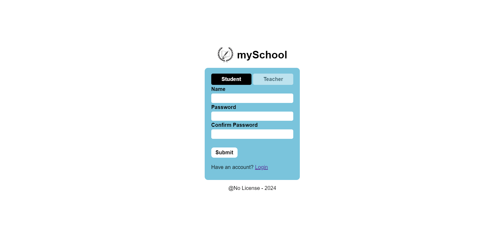

# mySchool-smartpath
___
### Pendahuluan
Project smartpath mengintegrasikan frontend, backend, dan database. Teknologi yang digunakan
- Runtime : Node JS
- Programming Language : Typescript
- HTTP Framework : Express
- Database : MySQL
- Query Builder : KNEX
- Authorization : Json Web Token
- API Design : REST API

Cara menjalankan backend
- Pertama aturlah .env
- Lalu download dependencies
- kedua jalankan `npx knex migrate:latest`
- ketiga jalankan `npm run serve`

___
### Frontend
Pada bagian frontend, telah dibuat beberapa page, tetapi tidak lengkap.
- Home
    - User bisa melihat realtime data mengenai jumlah student dan teacher
    - 

- Login
    - User bisa melakukan login untuk mendapatkan JWT
    - 

- Register
    - User bisa melakukan registrasi
    - 

___
### Database
Terdapat beberapa table pada database, tetapi hal yang sudah terimplementasi sebagai berikut
- teacher
- student

Selain itu terdapat table table lainnya untuk berlatih menggunakan knex
- class
- class_teacher_relation
- class_student_relation

___
### API
Terdapat beberapa API dan isi dari setiap API
- register
    - POST '/' : Untuk melakukan registrasi, dengan body berupa registerType, nama, dan password. Dan jika response ok akan memberikan id user dan data lainnya
- login
    - POST '/' : Untuk melakukan login, dengan body berupa loginType, id, dan password. dan jika response ok akan memberikan token. token berisi id dan loginType.
- studentApi
    - POST '/' : Untuk membuat data user baru.
    - GET '/count' : Untuk mendapatkan jumlah total dari student
    - GET '/:id' : Untuk mendapatkan data student dari pengguna, token harus sesuai dengan id request.
    - PUT '/:id' : Untuk melakukan update data student, token harus sesuai dengan id request
    - DELETE ':id' : Untuk melakukan delete data student, token harus sesuai dengan id request
- teacherApi
    - POST '/' : Untuk membuat data user baru.
    - GET '/count' : Untuk mendapatkan jumlah total dari teacher
    - GET '/:id' : Untuk mendapatkan data teacher dari pengguna, token harus sesuai dengan id request.
    - PUT '/:id' : Untuk melakukan update data teacher, token harus sesuai dengan id request
    - DELETE ':id' : Untuk melakukan delete data teacher, token harus sesuai dengan id request

___
### Testing
Untuk melakukan testing bisa langsung menjalankan
```sh
npm run test